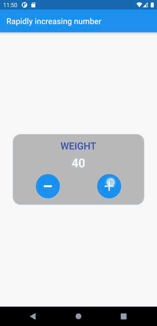

<!-- TIPS & TRICKS  https://www.markdownguide.org/hacks/ -->

<!-- For new line           ==>      -->
<!-- vertical space (tap)   ==>   &nbsp;  -->

<!-- Some of these words <ins>will be underlined</ins>  -->
<!-- 
This text is centered.
  -->

# Increase_numbers_rabidly_on_long_press

## A simple application for implementing on_long press behavior.

&ensp;
## ✌&ensp;Preview

&ensp;

